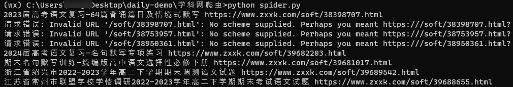
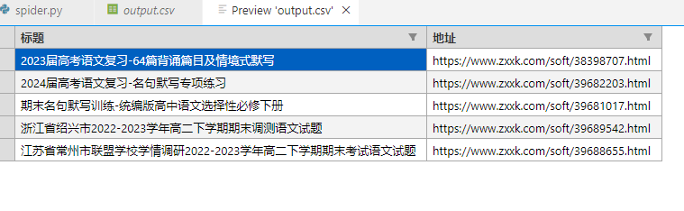

# 学科网的爬虫

**目的是获取 试卷的标题和相对应的链接**

## 声明

免责声明：

1. 本程序仅供学习和参考目的。作者力求保证程序的准确性和完整性，但不承担任何明示或暗示的担保责任。使用者应自行承担使用本程序的风险。
2. 本程序可能包含第三方提供的数据、信息或链接，这些内容仅供参考。作者无法保证这些内容的准确性、及时性和完整性，并不对因使用这些内容而导致的任何损失或损害承担责任。
3. 本程序可能会涉及与第三方网站或服务的交互，如通过API或其他方式。作者无法控制这些第三方网站或服务的可用性、安全性和准确性，并不对由于与这些网站或服务的交互而导致的任何损失或损害承担责任。
4. 本程序可能包含链接到其他网站的链接。这些链接仅供方便参考，不代表作者对这些网站的认可或担保。对于这些网站的内容、隐私政策或使用条款，作者不承担责任。
5. 使用本程序即表示您同意自行承担使用风险，并免除作者对使用本程序可能引发的任何损失或损害的责任。
6. 本程序严禁用作违法犯罪行为

## 使用

- 安装Python（略） 和 requests

  ```python
  pip install requests
  ```

- 安装BS4

  ```python
  pip install beautifulsoup4
  ```

- 在终端中使用以下命令

  ```shell
  python spider.py
  ```

  

## 示意图

### 使用方式



### 输出内容


